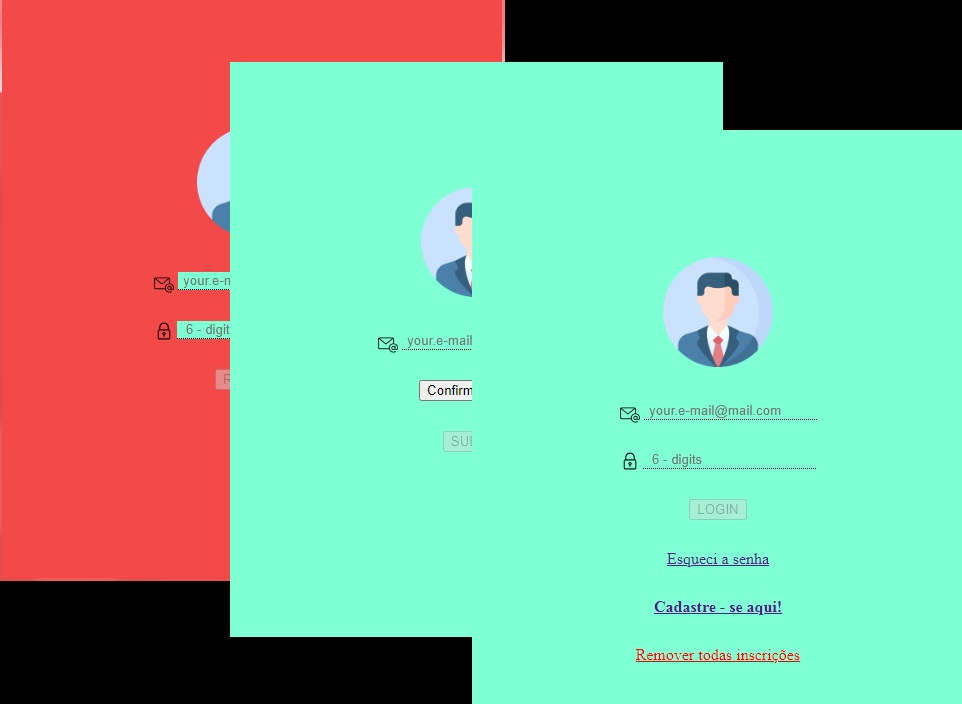

<h1 align="center"> Local Smart Form </h1>

"Local Smart Form" é um projeto que veio para sanar algumas curiosidades que implicavam em armazenamento local. Nele podemos trabalhar com valores recuperados entre paginas, bom como senhas esquecidas que podem ser enviadas atraves de resposta automática ao usuário. 
Ainda amador, mas bastante esclarecedor!!!

  <a href="#-tecnologias">Tecnologias</a>&nbsp;&nbsp;&nbsp;|&nbsp;&nbsp;&nbsp;
  <a href="#-projeto">Projeto</a>&nbsp;&nbsp;&nbsp;|&nbsp;&nbsp;&nbsp;
  <a href="#-layout">Layout</a>&nbsp;&nbsp;&nbsp;|&nbsp;&nbsp;&nbsp;
  <a href="#memo-licença">Considerações</a>

  

 

  

## 🚀 Tecnologias

Esse projeto foi desenvolvido com as seguintes tecnologias:

- HTML e CSS
- JavaScript
- Git e Github
- FormSubmit

## 💻 Projeto

Local Smart Form é um app que contém um formulário com paginas de cadastro, log, recuperação de senha e remoção de usuários. 
Os dados são armazenados e recuperados atraves de 'localstorage'. Através da ferramenta FormSubmit, uma senha esquecida é enviada ao usuário cadastrado.

-[Visite o projeto online](https://celo-gomes.github.io/localStorageForm)

## 🔖 Layout

Layout desenvolvido com simplicidade, visando apenas a fluidez de utilização pelo usuário. A futuro poderá ter arquivos css e script unificado e separado, ao contrário de hoje, que possui seu estilo e funções independentes por página.

## :memo: Considerações.

Esse projeto está sob a licença MIT. 
Utilizado componentes de ícones com menções à: 
<a href="https://www.flaticon.com/free-icons/user" title="user icons">User icons created by Freepik - Flaticon</a> 
<a href="https://www.flaticon.com/free-icons/email" title="email icons">Email icons created by Those Icons - Flaticon</a> 
<a href="https://www.flaticon.com/free-icons/password" title="password icons">Password icons created by Prosymbols Premium - Flaticon</a> 
<a href="https://www.flaticon.com/free-icons/user" title="user icons">User icons created by Freepik - Flaticon</a>

---

Feito com ♥ by M. Gomes :wave: [Visite no GitHub!](https://celo-gomes.github.io/rkt-port)
